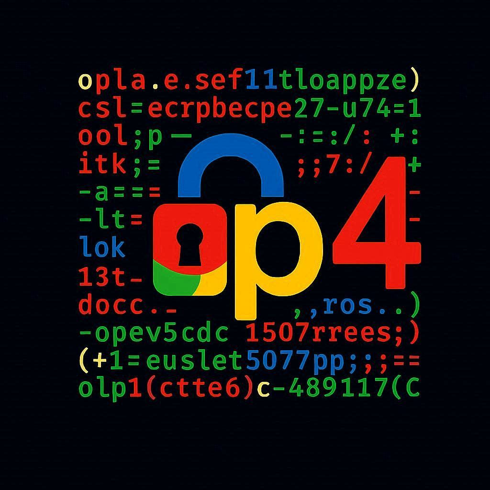

  
</br>
</br>

<b>op4 — Secure Terminal Messenger</b>

Op4 is a terminal-based encrypted messaging application written in Rust.
It provides end-to-end encrypted private messaging with post-quantum
cryptography, routed entirely through the Tor network so that
neither the content of your messages nor your IP address is exposed to
anyone — not even the person you are talking to.

</br>
</br>
</br>
</br>
</br>

## Table of Contents

1. [What op4 Does](#what-op4-does)
2. [Installation](#installation)
3. [Connecting to Another User](#connecting-to-another-user)
4. [Security Model](#security-model)
5. [Architecture Overview](#architecture-overview)
6. [Project Layout](#project-layout)
7. [Current Status](#current-status)

---

## What op4 Does

op4 lets two people exchange private messages without either party
revealing their IP address or real identity. Every message is:

- **End-to-end encrypted** using a Double Ratchet protocol — the same
  fundamental design used by Signal.
- **Post-quantum hardened** — the key exchange layer combines classical
  X25519 with ML-KEM-768 (NIST-standardised lattice-based KEM), so a
  future quantum computer cannot retroactively decrypt recorded traffic.
- **Anonymised** — all traffic travels over Tor hidden services
  (.onion addresses). Your IP address is never exposed to your contact or
  to any network observer.
- **Stored locally** — there is no server. Your messages and contacts live
  in an encrypted vault file on your own machine, and nowhere else.

op4 runs entirely in the terminal. It has no GUI, no browser component,
and no cloud account. The only external process it contacts is the Tor
daemon running on your own machine.

---

## Installation

> **All download options** — AppImage, source tarball, clone & build, and
> automated installer — are documented in the
> [Downloads & Install guide](docs/DOWNLOADS.md).
> The latest release is available on the
> [Releases page](https://github.com/Opfour/op4/releases/latest).

### Debian / Ubuntu (automated)

On Debian and Ubuntu, `install/setup.sh` handles everything in one command:
Rust toolchain, build dependencies, Tor, control port configuration, binary
compilation, system user, data directory, and AppArmor profile.

```bash
git clone https://github.com/Opfour/op4.git
cd op4
sudo bash install/setup.sh
```

> **After the script finishes, you must log out and log back in before
> running op4.** The installer adds your user to the `debian-tor` group
> so it can read the Tor cookie file. Linux does not apply group changes
> to already-open sessions — a fresh login is required.
>
> Skipping this step will cause op4 to fail at startup with:
> `Permission denied reading /run/tor/control.authcookie`

Then verify the source hash printed by the script matches the published
release hash for your version before trusting the binary.

### Release hash verification

When op4 starts it prints a source hash covering all Rust source files,
`Cargo.toml`, `Cargo.lock`, and `build.rs`. Compare it against the value
below for the version you installed.

| Version | Source hash |
|---|---|
| `0.3.0` | `80820cb41a63575d2c139dadd425d13d1e87e62a9d60200ae7b894ae2e9ad8ed` |
| `0.2.0-dev` | `35740577f6c4a4f19c5a08fe85b1f78a10347f2ba9dd7642d126552266bfa5a5` |
| `0.1.0` | `e1a94761c7d3fa589ba892b47d5295aa417f95aee126809d51a7e7fb7e78982c` |

You can also check it without launching the full app:

```bash
op4 --print-hash
```

If the hash does not match, do not use the binary — it was either built
from a different commit or has been tampered with.

### Fedora / Arch / other distros (manual)

Install dependencies first, then run the script:

**Rust toolchain** (pinned to 1.89.0 via `rust-toolchain.toml`):

```bash
curl --proto '=https' --tlsv1.2 -sSf https://sh.rustup.rs | sh
source "$HOME/.cargo/env"
```

**Tor and build dependencies:**

```bash
# Fedora
sudo dnf install tor gcc pkg-config openssl-devel

# Arch
sudo pacman -S tor base-devel pkg-config openssl
```

**Configure Tor control port** — add to `/etc/tor/torrc`:

```
ControlPort 9051
CookieAuthentication 1
```

```bash
sudo systemctl restart tor
```

**Add your user to the Tor group:**

```bash
sudo usermod -aG tor $USER        # Fedora / Arch
```

> **You must log out and log back in after this step.** Group membership
> changes are not applied to active sessions. Until you do, op4 will fail
> with `Permission denied reading /run/tor/control.authcookie`.
>
> To apply the change without a full logout, run:
> ```bash
> newgrp tor
> ```

**Build and install:**

```bash
git clone https://github.com/Opfour/op4.git
cd op4
cargo build --release
sudo bash install/setup.sh
```

### Run

```bash
op4
# or, without system install:
./target/release/op4
```

On first launch op4 will guide you through setting a normal passphrase
and a duress passphrase, then generate your identity keys. Your vault is
stored at `~/.local/share/op4/vault.op4`.

### Supported platforms

| Distro | Status |
|---|---|
| Ubuntu 22.04 / 24.04 | Supported |
| Debian 12 | Supported |
| Fedora 39+ | Supported |
| Arch Linux (current) | Supported |
| Tails OS | Supported ([setup guide](docs/DOWNLOADS.md#option-5--tails-os-persistent-storage)) |
| macOS / Windows / WSL1 | Not supported |

Minimum kernel: **4.15** (5.4+ recommended). Architecture: **x86-64**
(aarch64 should work but is untested).

---

## Connecting to Another User

Two people each need op4 installed, Tor running, and their vault
unlocked. The exchange is asymmetric: one person sends their contact
code first, the other adds it, then sends their first message, which
arrives as a pending request that the first person accepts.

### Step 1 — First launch

On first run op4 prompts for a **normal passphrase** and a **duress
passphrase**, then generates your identity keys. This only happens once.
Your vault is stored at `~/.local/share/op4/vault.op4`.

```
$ op4
```

### Step 2 — Get your contact code

Your contact code contains your full public key bundle and your `.onion`
address. The other person needs this to reach you.

1. Navigate to the **Contacts** tab (press `2` or `→`)
2. Press **`e`** to export your contact code
3. Your code appears on screen — it is a long Base58 string starting
   with `op4:`
4. Copy it and send it to the other person **out of band** (Signal,
   email, in person, etc.)

> Your contact code is not secret. It is safe to share publicly.
> It contains only your public keys and onion address — no private material.

### Step 3 — Add the other person as a contact

Once you have their contact code:

1. In the **Contacts** tab, press **`a`** to add a contact
2. Paste their `op4:` contact code and press **Enter**
3. Give them a name and press **Enter**

### Step 4 — Send your first message

1. Select the contact from your contacts list (use `↑`/`↓`, then `Enter`)
2. Switch to the **Messages** tab (press `3` or `→`)
3. Type your message and press **Enter**

This first message initiates the encrypted handshake and is delivered
to their `.onion` address over Tor. They will see it as a **pending
contact request**.

### Step 5 — Accept an incoming request

When someone sends you a first message, a badge appears on the Contacts
tab showing how many requests are waiting.

1. Go to the **Contacts** tab (press `2`)
2. Press **`p`** to review pending requests
3. You will see the sender's **fingerprint** and their **first message**
4. Type a name for this contact and press **Enter** to accept
   (press **`Esc`** to reject and discard)

Once accepted, the Double Ratchet is initialised and the conversation
is immediately available in the Messages tab.

### Step 6 — Verify the fingerprint (recommended)

Before trusting a contact, confirm their fingerprint matches what they
show on their own screen. This prevents a man-in-the-middle attack
during the initial contact exchange.

1. In the **Contacts** tab, select the contact
2. The fingerprint panel on the right shows a 16-group hex string,
   e.g. `A3F2:91BC:…`
3. Ask the other person to read their fingerprint for your entry — it
   must match exactly
4. Verification can be done over a voice call, in person, or any other
   channel where you can confirm their identity

### Navigation reference

| Key | Action |
|-----|--------|
| `1` / `←` `→` | Switch tabs (Contacts / Messages / Settings) |
| `↑` `↓` | Move selection |
| `Enter` | Open conversation / confirm |
| `Esc` | Cancel / go back |
| `e` | Export your contact code (Contacts tab) |
| `a` | Add a contact (Contacts tab) |
| `p` | Review pending requests (Contacts tab) |
| `d` | Delete selected contact (Contacts tab) |
| `r` | Rotate your keys (Settings tab) |
| `q` | Quit |

### Key rotation

If you believe your identity keys may be compromised:

1. Go to the **Settings** tab (press `4` or navigate right)
2. Press **`r`** to rotate keys
3. op4 generates a new keypair, signs a revocation certificate with
   your old key, and broadcasts it to all your contacts over Tor
4. Your contact code changes — share the new one with your contacts

---

## Security Model

### Cryptographic primitives (all from the RustCrypto ecosystem)

| Purpose | Algorithm |
|---|---|
| Vault key derivation | Argon2id (m=64 MiB, t=3, p=1) |
| Vault encryption | ChaCha20-Poly1305 (256-bit key, 96-bit nonce) |
| Message encryption | ChaCha20-Poly1305 (per-message key from ratchet) |
| Key derivation (ratchet) | HKDF-SHA256 |
| Deniable authentication | HMAC-SHA256 |
| Classical key exchange | X25519 |
| Post-quantum key exchange | ML-KEM-768 (FIPS 203) |
| Classical signatures | Ed25519 |
| Post-quantum signatures | ML-DSA-65 (FIPS 204) |
| Transport anonymity | Tor v3 hidden services (.onion) |

### Double Ratchet

op4 uses a Double Ratchet protocol (similar to Signal Protocol) for
forward secrecy. This means:

- Each message is encrypted with a unique key derived from a ratchet chain.
- Compromising one message key does not expose any other message.
- If your device is seized, past messages that have already been deleted
  cannot be decrypted even if the attacker learns your vault passphrase.

### Hybrid post-quantum key exchange

The KEM step combines X25519 and ML-KEM-768 as follows:

```
shared_secret = HKDF(X25519_ss || MLKEM_ss)
```

An attacker must break **both** algorithms to compromise the key exchange.
This protects against a quantum adversary (ML-KEM-768) while remaining
secure against classical attacks if ML-KEM-768 has an unknown flaw
(X25519 fallback).

### Deniable authentication

Messages are authenticated with HMAC-SHA256 using a key derived from the
shared ratchet state. Because both parties hold the same HMAC key, either
party could have produced any given MAC. This is the same deniability
property used by OTR and Signal: messages cannot be cryptographically
attributed to a specific sender in a court proceeding.

### Vault and duress passphrase

The vault file at `~/.local/share/op4/vault.op4` stores all contacts,
conversations, and identity keys. It is protected with two independent
Argon2id-derived keys:

- **Normal passphrase** — unlocks your real contacts and messages.
- **Duress passphrase** — unlocks a visually identical but empty decoy
  inbox. Use this if you are coerced into unlocking the app. From the
  outside the two passphrases are indistinguishable.

### Network anonymity

op4 creates a Tor v3 hidden service for your inbox. Your `.onion` address
is derived deterministically from your identity key (via HKDF), so it is
stable across restarts without needing to store a separate key. Outbound
messages are sent through the Tor SOCKS5 proxy. Your real IP address never
appears in any network packet related to op4.

Cover traffic (Poisson-distributed dummy messages sent to self,
mean interval 30 seconds) prevents a network observer from learning
whether you are actively messaging someone by watching traffic volume.

### OS-level hardening

- **mlockall** — prevents vault keys and plaintext from being written
  to swap.
- **RLIMIT_CORE = 0** — disables core dumps that could expose memory.
- **PR_SET_DUMPABLE = 0** — prevents other processes from attaching a
  debugger.
- **seccomp-bpf** — installs a syscall allowlist. Any syscall not in
  the list causes the process to be killed immediately.
- **AppArmor profile** (`apparmor/op4.profile`) — restricts filesystem
  access to only the vault directory, terminal devices, and Tor.

---

## Architecture Overview

```
┌─────────────────────────────────────────────────────────────┐
│                        op4 process                          │
│                                                             │
│  ┌──────────┐   ┌──────────────────┐   ┌────────────────┐  │
│  │   TUI    │   │  Double Ratchet  │   │  Tor Transport │  │
│  │ (ratatui)│──▶│  + Hybrid PQ     │──▶│  nym_client.rs │  │
│  │          │   │  Crypto          │   │                │  │
│  └──────────┘   └──────────────────┘   └───────┬────────┘  │
│                                                │           │
│  ┌──────────────────────────────┐              │           │
│  │  Encrypted Vault             │    SOCKS5 / control port │
│  │  ~/.local/share/op4/vault.op4│              │           │
│  └──────────────────────────────┘              │           │
└────────────────────────────────────────────────┼───────────┘
                                                 │
                                    ┌────────────▼────────────┐
                                    │      Tor daemon         │
                                    │  127.0.0.1:9050 (SOCKS) │
                                    │  127.0.0.1:9051 (ctrl)  │
                                    └────────────┬────────────┘
                                                 │
                                         Tor network
                                                 │
                                    ┌────────────▼────────────┐
                                    │  Peer's .onion address  │
                                    │  (their hidden service) │
                                    └─────────────────────────┘
```

---

## Project Layout

```
op4/
├── src/
│   ├── main.rs                  Entry point, startup sequence
│   ├── error.rs                 Unified error types
│   ├── crypto/
│   │   ├── keys.rs              Hybrid KEM + signature keypairs
│   │   ├── primitives.rs        AEAD, HKDF, HMAC, Argon2id
│   │   ├── ratchet.rs           Double Ratchet implementation
│   │   ├── hmac_auth.rs         Deniable authentication tags
│   │   └── handshake.rs         Initial key agreement (X3DH-style)
│   ├── network/
│   │   ├── nym_client.rs        Tor hidden-service transport
│   │   └── message.rs           Wire message format + padding
│   ├── storage/
│   │   └── vault.rs             Encrypted vault (Argon2id + AEAD)
│   ├── identity/
│   │   ├── profile.rs           Contact codes, stored contacts
│   │   └── revocation.rs        Key revocation records
│   ├── hardening/
│   │   ├── memory.rs            mlockall, RLIMIT_CORE, dumpable
│   │   └── seccomp.rs           seccomp-bpf syscall filter
│   └── ui/
│       ├── app.rs               TUI event loop and state machine
│       ├── contacts.rs          Contacts tab rendering
│       ├── conversation.rs      Messages tab rendering
│       ├── settings.rs          Settings tab rendering
│       ├── duress.rs            Duress inbox rendering
│       ├── input.rs             Input sanitization (CSI/OSC strip)
│       └── passphrase.rs        Secure passphrase prompts
├── apparmor/
│   └── op4.profile              AppArmor MAC profile
├── install/
│   └── setup.sh                 System installation script
├── build.rs                     Embeds source hash at compile time
├── deny.toml                    cargo-deny licence + advisory rules
├── rust-toolchain.toml          Pins Rust 1.89.0
└── docs/                        This documentation
```

---

## Current Status

**Version: 0.2.0-dev (pre-release)**

op4 is under active development. The following layers are complete and
tested:

- Vault (create, unlock, save, duress mode)
- All cryptographic primitives (12/12 unit tests passing)
- Tor hidden-service transport (connect, send, receive, cover traffic)
- Terminal UI (navigation, contacts management, conversation view)
- OS hardening (memory, seccomp, AppArmor)

All layers are now wired end-to-end:

- Identity keypairs (X25519+ML-KEM-768, Ed25519+ML-DSA-65) are generated
  on first run and stored encrypted in the vault.
- Contact code export produces a real Base58-encoded `PublicKeyBundle`
  (your full public key set + onion address).
- Sending a message performs a full X3DH-style handshake on the first
  message to a contact, then Double Ratchet encryption on subsequent
  messages, transmitted over Tor.
- Inbound messages are polled from the Tor transport in the TUI event
  loop and displayed in the conversation view (sealed-sender pattern:
  the routing layer never reveals who sent the message).

All known limitations have been resolved. The application is now at
feature-complete status for 0.2.0-dev:

- **HMAC deniable authentication** is fully wired. Every outbound data
  message carries an HMAC-SHA256 tag computed from the per-message ratchet
  key over `(conversation_id || message_counter || ciphertext)`. Inbound
  messages are verified before being accepted; zero-filled tags from older
  peers are tolerated for backward compatibility.
- **Message history persists across restarts.** The full conversation log
  is encrypted with a per-conversation HKDF-derived key and stored in the
  vault's `message_log_ct` field. Messages are loaded from the vault when
  a conversation is opened and written back after each send or receive.
- **Inbound contact requests** from unknown parties are queued rather than
  dropped. The Contacts tab shows a badge when requests are waiting.
  Press `[p]` to review: you see the sender's fingerprint and their first
  message, type a name, and press Enter to accept (or Esc to reject). On
  acceptance the contact is added, the Double Ratchet is initialised, and
  the initial message is saved to the vault.
- **Duress vault preserved across saves.** The vault file format (v2) stores
  exact ciphertext lengths in the header so AEAD decryption operates on the
  real bytes rather than zero-padded sections. The encrypted duress section
  is stored verbatim on every `save()` call, keeping the duress passphrase
  valid indefinitely.
- **Dedicated Double Ratchet bootstrap key.** A separate X25519 keypair
  (`identity_ratchet_secret`) is generated on first run and included in the
  contact code as `ratchet_pub`. Alice's ratchet is initialised with Bob's
  `ratchet_pub` rather than his KEM identity key, separating key roles.
- **Settings tab fully functional.** Tor SOCKS5 address and auto-delete
  threshold can be edited inline. Key rotation (generates new keypair,
  broadcasts a signed revocation certificate to all contacts, refreshes the
  export code) and key retirement revocation are both wired and operational.
- **Key revocation wired end-to-end.** `RevocationCertificate` structs are
  signed with the hybrid Ed25519+ML-DSA-65 keypair and sent to all contacts
  as `WireMessageType::Revocation` messages over Tor.

    
